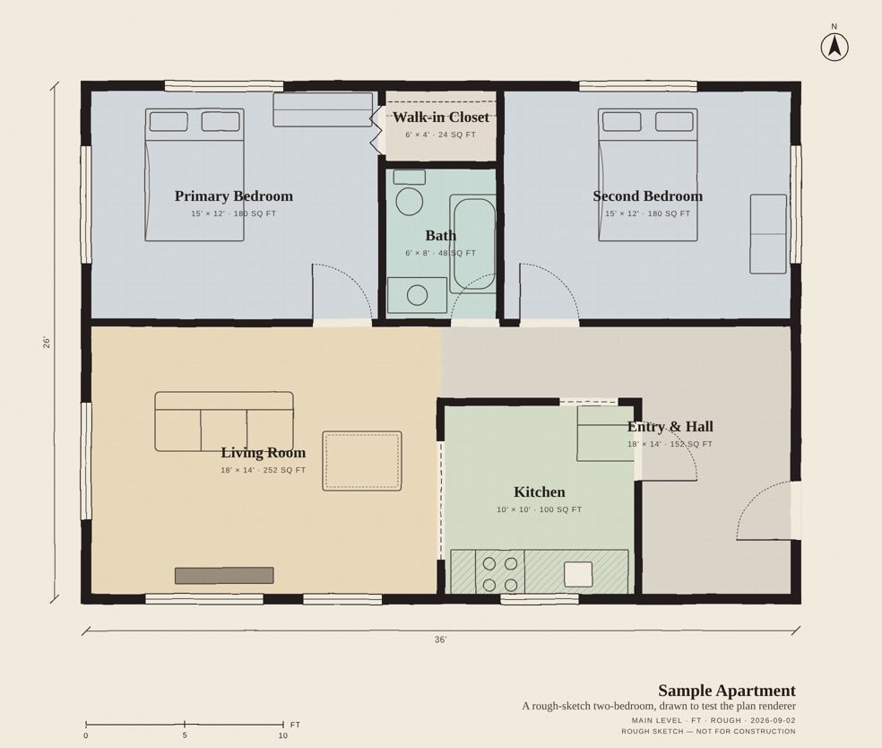

# For Dilene

A property you can walk through by scrolling. Built as a gift for Dilene Allen (Dilene Realty Group, eXp Realty, DFW) — and as the first engine for something bigger.

One plan file (`floorplan.json`) drives both a stylized ink-and-wash floor plan and a scroll-driven 3D walkthrough with a guided intro. No frameworks on top of Three.js, no page builders, nothing you don't own.

```
/            the Reveal — scroll walkthrough + the Docent guide
/plan/       the same property drawn as a floor plan (SVG, downloadable)
```

## Run it

```bash
nvm use            # Node 22
npm install
npm run dev        # http://localhost:5173
npm run build      # → dist/
npm run preview    # serve dist/ locally (offline demo)
npm run plan data/floorplans/sample-apt.json   # → out/sample-apt.svg
```

## Where things live

| Path | What |
|---|---|
| `data/floorplans/*.json` | One property per file. **This is the content.** |
| `data/brand.json` | Everything the site says about Dilene. All public facts. |
| `schema/floorplan.schema.json` | The contract for plan files (JSON Schema 2020-12). |
| `src/scene/` | Three.js: `house.ts` builds walls/floors/fixtures from the plan; `cameraRig.ts` maps scroll → camera path; `createScene.ts` renderer + lights. |
| `src/docent/` | The "what is this?" card and guided tour. |
| `src/plan/npr.js` | The floor-plan renderer (shared by the page and the CLI). |
| `tools/plan-render/` | CLI wrapper: plan JSON → SVG. |
| `docs/` | The canon. Start with `docs/README.md`. |
| `.claude/agents/docent.md` | The agent that owns the docent. |

## Milestones



**1 · The Reveal** — shown in person. Sample apartment, seven stops, dollhouse pull-back, plan page, her real contact block with Texas compliance. *This is what's here now.*

**2 · The Residence** — a measured real property, real furniture and materials, the zoom-out from the window to the DFW map on real terrain, a showing-request form, her domain. See `docs/site-spec.md`.

## First push (until the repo is attached to the Claude session)

```bash
cd Dilene_Real_Estate
git remote add origin https://github.com/Nymfarious/Dilene_Real_Estate.git
git push -u origin main
```

Then in Vercel: **Add New → Project → Import** this repo. Framework auto-detects as Vite. Every push to `main` deploys; every PR gets a preview URL.

## Conventions

- Feet everywhere. Plan coordinates: X east, Y north, origin at the south-west corner. Full rules in `docs/drafting-standards.md`.
- Facts about Dilene go in `brand.json` and nowhere else. Nothing is invented; if it isn't public, it isn't in the repo.
- The brass notice bar and the two TREC links stay until Dilene says the site is hers.
- Keep `main` deployable. Branches for experiments.

---
Private. Built with care, September 2026.
